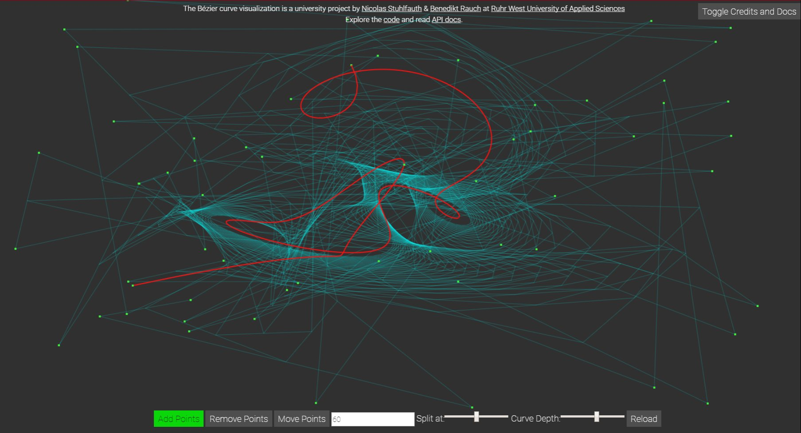

# Bézier curve visualization

This project provides an interactive visualization of Bézier curves.

### Features:
- Drawing a random curve with #n points
- Auxiliary visualization
- Adding some points
- Removing points
- Moving points
- Interactively changing t value and depth

### Give it a try!
You may either visit [https://nicostuhlfauth.github.io/hrw-bezier/]() or clone / download your own local copy.

## Docs
If you want to create your own project, which rests upon this repository or if you are interested in other ways as well, you may have a look at our [API Docs](https://nicostuhlfauth.github.io/hrw-bezier/docs).

## Build
We used some ES6 features, so if you change anything in `./decasteljau.js` (from root folder), make sure to run `npm run build` afterwards.

## About
This project has been created by [Nicolas Stuhlfauth](https://github.com/nicostuhlfauth) and [Benedikt Rauch](https://github.com/benediktrauch) as part of the academic module "Computergraphics and Visualization" within the Bachelor degree course Human-Machine-Interaction at Ruhr West University of Applied Sciences.

### License
[MIT](LICENSE).